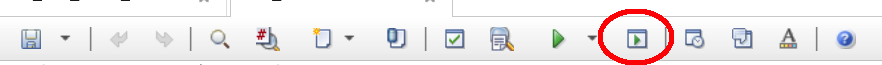
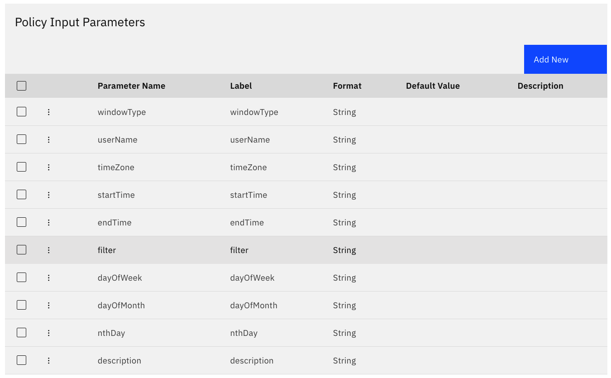

This policy is an example on how to automate creation of maintenance windows through the use of Impact's policy API. It is essentially a re-working of the Impact MWM_AddAllFromFile policy code, included with Impact, but rather than reading from a CSV this provides the ability to send in windows via REST API. 

09/20/24 Jason Cress (jcress@us.ibm.com)

****Creating the policy and policy parameters****

To use this policy, create a new IPL Impact policy named AA_Add_MWM_Via_REST. (We prepend name here to ensure the policy shows near the top of our policy list).

Paste the contents of the IPL file included in this repo.

Next, create the following input parameters in the policy settings, and they should all be of type string. Policy settings can be accessed by clicking on the policy settings icon in the policy editor toolbar:



These are the required input parameters, with explanation in parentheses.

**windowType** (otw=one time window, dow=day of week, dom=day of month, nth=nth day of month)\
**userName**\
**timeZone**\
**startTime** (in the form: HH:MM:SS, with the exception of one time window which should be "YYYY-MM-DD HH:mm:ss")\
**endTime** (as above)\
**filter** (a valid OMNIbus alerts.status filter, with double-quotes escaped via backslash as illustrated in the examples below)\
**dayOfWeek** (Mon,Tue,Wed,Thu,Fri,Sat,Sun, multiples separated by |)\
**dayOfMonth** (integer value represented as a string, with multiple days separated by |)\
**nthDay** (first-fifthDAY... e.g. firstSun, thirdSat, etc with multiples separated by |)\
**description** (freeform text)\

After adding the above input parameters, your policy settings input parameter list should look like this:


  
Finally, save your new policy.

****Creating a maintenance window via REST API call****

Any tool that can send a json payload to the Impact REST API can thus add a maintenance window, provided the appropriate credentials are provided. In this example, we use curl:

 
```shell
curl -k -u \<impactadminuser\>:\<impactadminpassword\> -d @t-win.json \\
https://\<impactserver>\:9081/restui/policyui/policy/AA_Add_MWM_Via_REST/runwithinputparameters \\ 
-H "Content-Type: application/json;charset=utf-8" 
```

...where t-win.json file contains:

```json
{
  "windowType": "otw",
  "userName": "impactadmin",
  "timeZone": "CST",
  "startTime": "1940-10-09 10:59:11",
  "endTime": "1940-10-09 11:59:11",
  "filter": "Node = \"dcmpr01\"",
  "description": "Adding a one time window for Node dcmpr01" 
}
```

... to add a one time window. 

Note that the date/time/timezone are expected in accepted format and not validated.
Therefore a MWM will be created with any format. See other examples below for day of week, day of month, and nth days:

****Additional Examples****

DAY OF WEEK: 
```json
{
    "windowType": "dow",
    "userName": "impactadmin",
    "timeZone": "CST",
    "dayOfWeek": "Wed",
    "startTime": "10:59:11",
    "endTime": "11:59:11",
    "filter": "Node = \"dcmpr01\"",
    "description": "Adding a day of week window for Node dcmpr01" 
}
```

DAY OF MONTH:
```json
{
    "windowType": "dom",
    "userName": "impactadmin",
    "timeZone": "CST",
    "startTime": "22:00:00",
    "endTime": "23:59:59",
    "dayOfMonth": "7|18|19",
    "filter": "Node = \"dcmpr01\"",
    "description": "Day of month window for the days 7th, 18th, and 19th for node dcmpr01" 
}
```

NTH DAY:
```json
{
    "windowType": "nth",
    "userName": "impactadmin",
    "timeZone": "CST",
    "startTime": "10:59:11",
    "endTime": "11:59:11",
    "filter": "Node = \"rodcs101\"",
    "nthDay": "fourthSun|fourthSat|fifthSun|fifthSat",
    "description": "Adding an nth day window for node rodcs101"
}
```


